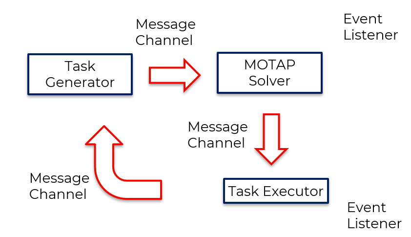
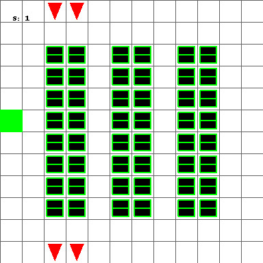
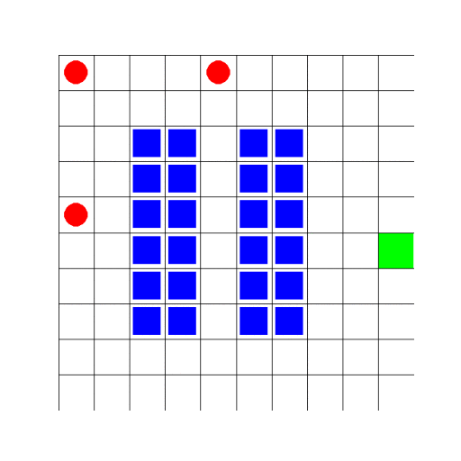

<div id="top"></div>

<!-- PROJECT SHIELDS -->
<!--[![Contributors][contributors-shield]][contributors-url]
[![Forks][forks-shield]][forks-url]
[![Stargazers][stars-shield]][stars-url]
[![Issues][issues-shield]][issues-url]
[![Apache-2.0 License][license-shield]][license-url]
[![LinkedIn][linkedin-shield]][linkedin-url]
-->
[![Issues][issues-shield]][issues-url]
[![Apache-2.0 License][license-shield]][license-url]


<!-- PROJECT LOGO -->
<br />
<div align="center">
<h3 align="center">Team PACTS</h3>

  <p align="center">
    Team Planning and Allocation of Continuous Task Streams (PACTS) is a multi-agent framework for continuous task allocation and planning.
    <br />
    <a href="https://github.com/tmrob2/team-PACTS"><strong>Explore the docs »</strong></a>
    <br />
    <br />
    ·
    <a href="https://github.com/tmrob2/team-PACTS/issues">Report Bug</a>
    ·
    <a href="https://github.com/tmrob2/team-PACTS/issues">Request Feature</a>
  </p>
</div>


<!-- TABLE OF CONTENTS -->
<summary>Table of Contents</summary>
<ol>
<li>
  <a href="#about-the-project">About The Project</a>
  <ul>
    <li><a href="#built-with">Built With</a></li>
  </ul>
</li>
<li>
  <a href="#getting-started">Getting Started</a>
  <ul>
    <li><a href="#prerequisites">Prerequisites</a></li>
    <li><a href="#installation">Installation</a></li>
  </ul>
</li>
<li>
  <a href="#usage">Usage</a>
  <ul>
    <li><a href="#smart-warehouse-motap-example">Smart warehouse MOTAP example</a></li>
    <li><a href="#continuous-task-stream-example">Continuous task stream Example</a></li>
  </ul>
</li>
<li><a href="#roadmap">Roadmap</a></li>
<li><a href="#contributing">Contributing</a></li>
<li><a href="#license">License</a></li>
<li><a href="#contact">Contact</a></li>
<li><a href="#acknowledgments">Acknowledgments</a></li>
</ol>


<!-- ABOUT THE PROJECT -->
## About The Project

### Continuous Task Allocation and Planning System Design

The following diagram presents a high level system design of planning and task allocation in continuous task streams. There are three major components, the Task generator, the black box MOTAP solver, and the task executor. The task generator is responsible for simulating or processing task events to be planned and allocated to agents. The MOTAP black box is responsible for batching tasks, conducting allocation and planning under constraints, and generating a randomised scheduler (policy). The task exector is responsible for sampling the schedulers (policies) generated by the MOTAP solver according to its associated randomised task allocation function. It is also responsible for executing the tasks to either completion or failure.  

<p align="center">
    
 <p align="center">Schematic of Continuou Task Streams</p>
</p>

<p align="right">(<a href="#top">back to top</a>)</p>

### Smart Warehouse Example Implementation

<table>
<tr>
<td>

</td>
<td>

</td>
</tr>
</table>


### Built With
* C
* [Rust v1.61](https://www.rust-lang.org/)
* Python 3.8

<p align="right">(<a href="#top">back to top</a>)</p>


<!-- GETTING STARTED -->
## Getting Started

### Prerequisites
Make sure that pip is installed and also best to have a virtual environment setup. 
```
pip install maturin

```

### Installation

#### Step 1. 
Install the Sparse BLAS C libraries

```
cd CXSparse
make
```

#### Step 2. 

Install the FFI Rust bindings to python with Maturin, which also installs all other project dependencies. 


<p align="right">(<a href="#top">back to top</a>)</p>


<!-- USAGE EXAMPLES -->
## Usage

### Smart Warehouse MOTAP Example

Setup the environment, and the environment params

```Python
#
# Params
#
NUM_TASKS = 2
NUM_AGENTS = 2


# ------------------------------------------------------------------------------
# SETUP: Construct the structures for agent to recognise task progress
# ------------------------------------------------------------------------------

task_progress = {0: "initial", 1: "in_progress", 2: "success", 3: "fail"}

# Set the initial agent locations up front
# We can set the feed points up front as well because they are static

init_agent_positions = [(0, 0), (4, 0)]
size = 10
feedpoints = [(size - 1, size // 2)]
print("Feed points", feedpoints)

# ------------------------------------------------------------------------------
# Env Setup: Construct the warehouse model as an gym like python environment
# ------------------------------------------------------------------------------
env: Warehouse = gym.make(
    "Warehouse-v0", 
    initial_agent_loc=init_agent_positions, 
    nagents=NUM_AGENTS,
    feedpoints=feedpoints,
    render_mode="human",
    size=size,
    seed=4321,
    disable_env_checker=True,
)

```

Generate some random task data

```Python
# We have to set the tasks racks and task feeds which depend on the number of tasks
# sample a list of ranks in the size of the number of tasks
rack_samples = random.sample([*env.warehouse_api.racks], k=NUM_TASKS * 2)
#env.warehouse_api.add_task_rack_end(0, rack_samples[0])
#env.warehouse_api.add_task_rack_start(0, rack_samples[0])
#env.warehouse_api.add_task_feed(0, feedpoints[0])
for k in range(NUM_TASKS):
    env.warehouse_api.add_task_rack_end(k, rack_samples[NUM_TASKS + k])
    env.warehouse_api.add_task_rack_start(k, rack_samples[0])
    env.warehouse_api.add_task_feed(k, feedpoints[0])

obs = env.reset()
```

Make an Executor which will store all of the required execution information from the MOTAP framework.

```Python 
# ------------------------------------------------------------------------------
# Executor: Define a new executor which will be used to continually run agents
# ------------------------------------------------------------------------------
s_executor = ce.SerialisableExecutor(NUM_AGENTS)

```

Construct tasks relevant to the environment labelling function.

```Python
# ------------------------------------------------------------------------------
# Tasks: Construct a DFA transition function and build the Mission from this
# ------------------------------------------------------------------------------

def warehouse_replenishment_task():
    task = ce.DFA(list(range(0, 8)), 0, [5], [7], [6])
    # attempt to goto the rack positon without carrying anything
    omega = set(env.warehouse_api.words)

    # The first transition determines if the label is at the rack
    task.add_transition(0, "RS_NC", 1)
    excluded_words = ['_'.join(x) for x in list(itertools.product(["RS", "RE", "NFR", "F"], ["P", "D", "CR", "CNR"]))]
    excluded_words.append("RE_NC")
    for w in excluded_words: 
        task.add_transition(0, f"{w}", 7)
    excluded_words.append("RS_NC")
    for w in omega.difference(set(excluded_words)):
        task.add_transition(0, f"{w}", 0)
    # The second transition determines whether the agent picked up the rack at the 
    # required coord
    task.add_transition(1, "RS_P", 2)
    excluded_words = ['_'.join(x) for x in list(itertools.product(["NFR"], ["P"]))]
    for w in excluded_words:
        task.add_transition(1, f"{w}", 7)
    excluded_words.append("RS_P")
    for w in omega.difference(set(excluded_words)):
        task.add_transition(1, f"{w}", 1)
    # The third transition takes the agent to the feed position while carrying
    task.add_transition(2, "F_CNR", 3)
    excluded_words = ['_'.join(x) for x in list(itertools.product(["F", "RS", "RE", "NFR"], ["NC", "P", "D", "CR"]))]
    for w in excluded_words:
        task.add_transition(2, f"{w}", 7)
    excluded_words.append("F_CNR")
    for w in omega.difference(set(excluded_words)):
        task.add_transition(2, f"{w}", 2)
    # The fourth transition takes the agent from the feed position while carrying 
    # back to the rack position
    task.add_transition(3, "RS_CNR", 4)
    excluded_words = ['_'.join(x) for x in list(itertools.product(["F", "RS", "RE", "NFR"], ["NC", "P", "D", "CR"]))]
    #excluded_words.append("RS_CNR")
    for w in excluded_words:
        task.add_transition(3, f"{w}", 7)
    excluded_words.append("RS_CNR")
    for w in omega.difference(set(excluded_words)):
        task.add_transition(3, f"{w}", 3)
    # The fifth transition tells the agent to drop the rack at the required square
    task.add_transition(4, "RS_D", 5)
    for w in omega.difference(set(["RS_D"])):
        task.add_transition(4, f"{w}", 4)
    for w in omega:
        task.add_transition(5, f"{w}", 6)
    for w in omega:
        task.add_transition(6, f"{w}", 6)
    for w in omega:
        task.add_transition(7, f"{w}", 7)
    
    return task

def warehouse_retry_task():
    task = ce.DFA(list(range(0, 8)), 0, [5], [7], [6])
    # attempt to goto the rack positon without carrying anything
    omega = set(env.warehouse_api.words)

    # The first transition determines if the label is at the rack
    task.add_transition(0, "RS_NC", 1)
    excluded_words = ['_'.join(x) for x in list(itertools.product(["RS", "RE", "NFR", "F"], ["P", "D", "CR", "CNR"]))]
    excluded_words.append("RE_NC")
    for w in excluded_words: 
        task.add_transition(0, f"{w}", 7)
    excluded_words.append("RS_NC")
    for w in omega.difference(set(excluded_words)):
        task.add_transition(0, f"{w}", 0)
    # The second transition determines whether the agent picked up the rack at the 
    # required coord
    task.add_transition(1, "RS_P", 2)
    excluded_words = ['_'.join(x) for x in list(itertools.product(["NFR", "RE"], ["P"]))]
    for w in excluded_words:
        task.add_transition(1, f"{w}", 7)
    excluded_words.append("RS_P")
    for w in omega.difference(set(excluded_words)):
        task.add_transition(1, f"{w}", 1)
    # The third transition takes the agent to the feed position while carrying
    task.add_transition(2, "F_CNR", 3)
    excluded_words = ['_'.join(x) for x in list(itertools.product(["F", "RS", "RE", "NFR"], ["NC", "P", "D", "CR"]))]
    for w in excluded_words:
        task.add_transition(2, f"{w}", 7)
    excluded_words.append("F_CNR")
    for w in omega.difference(set(excluded_words)):
        task.add_transition(2, f"{w}", 2)
    # The fourth transition takes the agent from the feed position while carrying 
    # back to the rack position
    task.add_transition(3, "RE_CNR", 4)
    excluded_words = ['_'.join(x) for x in list(itertools.product(["F", "RS", "RE", "NFR"], ["NC", "P", "D", "CR"]))]
    excluded_words.append("RS_CNR")
    for w in excluded_words:
        task.add_transition(3, f"{w}", 7)
    excluded_words.append("RE_CNR")
    for w in omega.difference(set(excluded_words)):
        task.add_transition(3, f"{w}", 3)
    # The fifth transition tells the agent to drop the rack at the required square
    task.add_transition(4, "RE_D", 5)
    for w in omega.difference(set(["RE_D"])):
        task.add_transition(4, f"{w}", 4)
    for w in omega:
        task.add_transition(5, f"{w}", 6)
    for w in omega:
        task.add_transition(6, f"{w}", 6)
    for w in omega:
        task.add_transition(7, f"{w}", 7)
    
    return task

```

Construct a Mission for the agents to carry out

```Python

# Initialise the mission
mission = ce.Mission()

# In this test there is only one task
dfa = warehouse_replenishment_task()
dfa_retry = warehouse_retry_task()
# Add the task to the mission
for k in range(NUM_TASKS):
    mission.add_task(dfa_retry)
```

Given some target constraints and an initial weight vector, solve the batch of tasks. 

```Python
# Solve the product Model
scpm = ce.SCPM(mission, NUM_AGENTS, list(range(6)))
w = [0] * NUM_AGENTS + [1./ NUM_TASKS] * NUM_TASKS
eps = 0.0001
target = [-80., -150.] + [0.7] * NUM_TASKS


task_map = {0: 0, 1: 1}
sol_not_found = True
while sol_not_found:
    try:
        tnew = ce.scheduler_synth(scpm, env.warehouse_api, w, target, eps, s_executor)
        print(tnew)
        sol_not_found = False
    except Exception as e:
        print(e)
        continue
```

Rendering the executor

```Python 
executor = s_executor.convert_to_executor(NUM_AGENTS, NUM_TASKS)

while True:
    # Initialise the actions to do nothing
    actions = [6] * NUM_AGENTS
    for agent in range(NUM_AGENTS):
        # Condition: If the agent is not working then it is available to work
        # on a new task
        if env.agent_task_status[agent] == env.AgentWorkingStatus.NOT_WORKING:
            task = executor.get_next_task(agent)
            env.agent_performing_task[agent] = task
            env.states[agent] = (env.states[agent][0], 0, None)
            if task is not None:
                # Update the agent as working on a task and store in the env
                env.agent_task_status[agent] = env.AgentWorkingStatus.WORKING
            if task is not None:
                print("rack: ", env.warehouse_api.task_racks_end)
        else:
            # Check if the agent's task has been completed
            if env.agent_performing_task[agent] is not None:
                status = executor.check_done(env.agent_performing_task[agent])
                if task_progress[status] in ["success", "fail"]:
                    print(f"Task {env.agent_performing_task[agent]} -> {task_progress[status]}")
                    # goto the the next task
                    env.agent_task_status[agent] = env.AgentWorkingStatus.NOT_WORKING
                    env.agent_rack_positions[agent] = None

        # With the current task check what the dfa state is
        if env.agent_performing_task[agent] is not None:
            q = executor.dfa_current_state(env.agent_performing_task[agent])
            # Set the current task in the environment
            env.warehouse_api.set_task_(env.agent_performing_task[agent])
            # Get the action from the scheduler stored in the executor
            actions[agent] = executor.get_action(agent, env.agent_performing_task[agent], env.states[agent], q)

    # step the agent forward one timestep
    obs, rewards, dones, info = env.step(actions)


    # Step the DFA forward
    for agent in range(NUM_AGENTS):
        current_task = env.agent_performing_task[agent]
        if current_task is not None:
            q = executor.dfa_current_state(current_task)
            executor.dfa_next_state(current_task, q, info[agent]["word"])
            qprime = executor.dfa_current_state(current_task)
```
<p align="right">(<a href="#top">back to top</a>)</p>

### Continuous Task Stream Example

To see an example of the usage of a continuous task stream, there are three example implementations which need to run concurrently. In seperate terminals run:
```sh
python warehouse_event_handler.py
```

The interval is the number of batches to group together in a MOTAP model. 
```sh
python pipeline --interval=5 --eps=0.00001
```

```sh
python executor.py
```

<!-- ROADMAP -->
## Roadmap

- [ ] 

See the [open issues](https://github.com/tmrob2/team-PACTS/issues) for a full list of proposed features (and known issues).

<p align="right">(<a href="#top">back to top</a>)</p>


<!-- CONTRIBUTING -->
## Contributing

Contributions are what make the open source community such an amazing place to learn, inspire, and create. Any contributions you make are **greatly appreciated**.

If you have a suggestion that would make this better, please fork the repo and create a pull request. You can also simply open an issue with the tag "enhancement".
Don't forget to give the project a star! Thanks again!

1. Fork the Project
2. Create your Feature Branch (`git checkout -b feature/AmazingFeature`)
3. Commit your Changes (`git commit -m 'Add some AmazingFeature'`)
4. Push to the Branch (`git push origin feature/AmazingFeature`)
5. Open a Pull Request

## Project Layout

src /

    |- agent /

            |- agent.rs: Contains MDP and Team (team of agents) implementation

    |- algorithm /

            |- dp.rs: Contains dynamic programming functions: Value iteration, Value iteration for
             initial scheduler, random proper scheduler generation, argmax transition and reward 
             matrix creation

            |- synth.rs: Scheduler synthesis algorithm

    |- c-binding /

            |- suite_sparse.rs: FFI for CX Sparse from Suite-Sparse - sparse matrix BLAS functions

    |- dfa /

            |- dfa.rs: deterministic finite automaton, and Mission (batch of tasks) implementation

    |- lp /

            |- pylp.py: python GIL linear programming interface. Rust calls these scripts

            through py03. Written in python to fill the scientific computing gap in Rust.

    |- parallel /

            |- threaded.rs: processing a collection of multi-objective product MDPs instatiated
             using MOProductMDP struct and implementation. Generates an mpsc channel, and a fixed 
             size threadpool to compute the value iteration of the MDPs in parallel. 

    |- scpm / (Could be deprecated)

            |-model.rs: Contains the Product MDP M x A where M is the agent MDP and A is a DFA
             corresponding to task j, called the MOProductMDP and its implementation. Also Contains 
             a MOTAP problem meta struct called SCPM, which for a given batch, contains the team of
              agents -> Team and the collection of tasks -> Mission. SCPM implements the product 
             builder function for generating MOProductMDPs

    |- lib.rs: Library of general helper functions and utilities. Contains cBLAS FFI functions, the 
    wrappert to CX Sparse BLAS functions, value iteration helpers, python interface linking, 
    numeric helpers, and lp python wrappers

tests/

    |- testing the framework interface on a simple scalable problem

build.rs: Contains the build file for linking to C libs. 

<p align="right">(<a href="#top">back to top</a>)</p>


<!-- LICENSE -->
## License

Distributed under the Apache-2.0 License. See `LICENSE` for more information.

<p align="right">(<a href="#top">back to top</a>)</p>


<!-- CONTACT -->
## Contact

Thomas Robinson - [@twitter_handle](https://twitter.com/twitter_handle) - tmr463@uowmail.edu.au

Project Link: [https://github.com/tmrob2/team-PACTS](https://github.com/tmrob2/team-PACTS)

<p align="right">(<a href="#top">back to top</a>)</p>


<!-- ACKNOWLEDGMENTS -->
## Acknowledgments

* []()
* []()
* []()

<p align="right">(<a href="#top">back to top</a>)</p>


<!-- MARKDOWN LINKS & IMAGES -->
<!-- https://www.markdownguide.org/basic-syntax/#reference-style-links -->
[contributors-shield]: https://img.shields.io/github/contributors/tmrob2/team-PACTS.svg?style=for-the-badge
[contributors-url]: https://github.com/tmrob2/team-PACTS/graphs/contributors
[forks-shield]: https://img.shields.io/github/forks/tmrob2/team-PACTS.svg?style=for-the-badge
[forks-url]: https://github.com/tmrob2/team-PACTS/network/members
[stars-shield]: https://img.shields.io/github/stars/tmrob2/team-PACTS.svg?style=for-the-badge
[stars-url]: https://github.com/tmrob2/team-PACTS/stargazers
[issues-shield]: https://img.shields.io/github/issues/tmrob2/team-PACTS.svg?style=for-the-badge
[issues-url]: https://github.com/tmrob2/team-PACTS/issues
[license-shield]: https://img.shields.io/github/license/tmrob2/team-PACTS.svg?style=for-the-badge
[license-url]: https://github.com/tmrob2/team-PACTS/blob/master/LICENSE
[linkedin-shield]: https://img.shields.io/badge/-LinkedIn-black.svg?style=for-the-badge&logo=linkedin&colorB=555
[linkedin-url]: https://linkedin.com/in/linkedin_username
[coll-avoidance]: img/12x12-4a-9t-collision-avoidance.gif
[task-stream-example]: img/cts_example_sw.gif
[mdp-example]: img/product_mdp_message_sending.png

    
